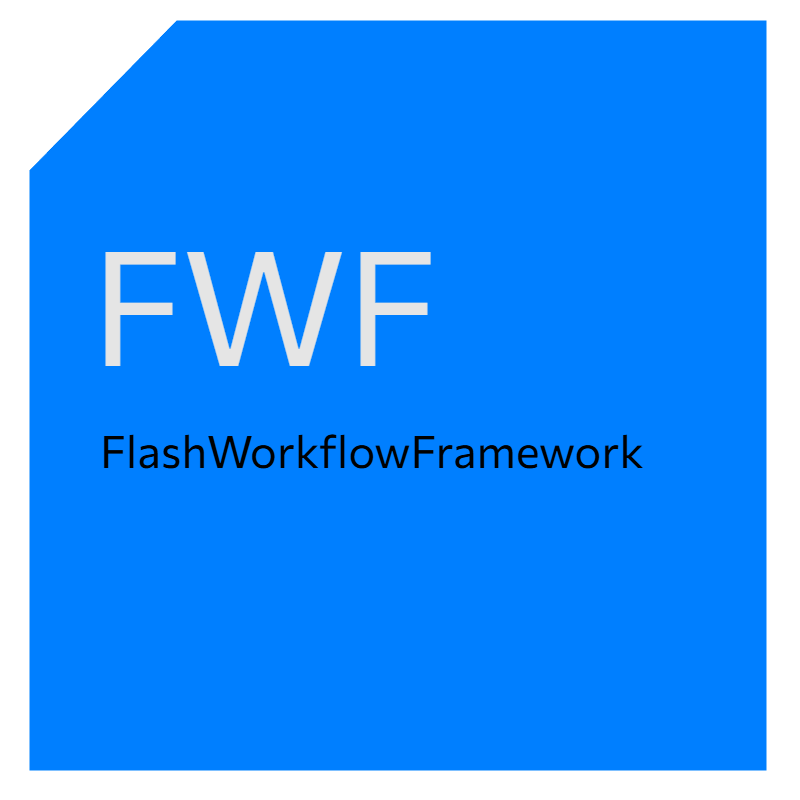

# FlashWorkflowFramework (FWF)

FlashWorkflowFramework (FWF) 是一个基于.NET 9.0的命令行工具，用于解压指定的ZIP文件到固定目录，解析其中的XML工作流配置文件，并按照工作流执行命令和下载操作。


# 永久免费，严禁倒卖！


## 功能特性

- **ZIP解压**：将指定ZIP文件解压到固定目录（如C:\FWF）
- **XML解析**：解析解压后的XML工作流配置文件
- **命令执行**：在工作流中执行tool文件夹下的开发者工具
- **下载引擎**：根据XML配置下载传统刷机包
- **实时日志**：显示详细的执行过程和状态信息

## 系统要求

- .NET 9.0 运行时
- Windows 10/11 (x64)

## 安装

### 从源码构建

```bash
git clone https://github.com/GHhuang1057/FWF.git
cd FWF
dotnet publish -c Release -r win-x64 --self-contained
```

### 直接下载

从 Releases页面下载最新版本的fwf。

## 使用方法

### 基本用法

```bash
# 基本用法：解压并执行ZIP中的工作流
fwf.exe "path/to/rom_package.zip"

# 指定输出目录
fwf.exe "rom.zip" --output "C:\FWF\output"

# 指定工作流文件名称（如果不是默认的workflow.xml）
fwf.exe "rom.zip" --workflow "custom_workflow.xml"

# 设置工作流变量
fwf.exe "rom.zip" --var:Device=raphael --var:AndroidVersion=13
```

### 命令行参数

```bash
fwf.exe <zip_file> [options]

参数:
  <zip_file>             要处理的ZIP文件路径

选项:
  -o, --output <path>    输出目录路径（默认：C:\FWF\output）
  -w, --workflow <name>  工作流文件名（默认：workflow.xml）
  -t, --temp <path>      临时工作目录（默认：C:\FWF\temp）
  --var:<name>=<value>   设置工作流变量
  -v, --verbose          详细日志输出
  --keep-temp            保留临时文件（默认会清理）
```

## 工作流格式

工作流文件是一个XML文件，定义了要执行的一系列步骤。以下是一个完整的示例：

```xml
<Workflow Name="MIUI转换工作流" Version="1.0">
  <Variables>
    <Variable Name="DeviceCode" Value="raphael" />
    <Variable Name="ROMVersion" Value="MIUI14" />
  </Variables>
  
  <Steps>
    <!-- 下载文件 -->
    <Step Type="Download" Name="下载MIUI固件">
      <Url>https://example.com/firmware.zip</Url>
      <Output>$(SessionDir)/downloads/firmware.zip</Output>
      <Checksum Type="MD5">a1b2c3d4e5f678901234567890123456</Checksum>
      <RetryCount>3</RetryCount>
    </Step>
    
    <!-- 执行工具 -->
    <Step Type="ExecuteTool" Name="解压MIUI固件">
      <Tool>payload-dumper.exe</Tool>
      <Arguments>"$(SessionDir)/downloads/firmware.zip" "$(SessionDir)/extracted"</Arguments>
      <WorkingDirectory>$(SessionDir)/tool</WorkingDirectory>
      <Timeout>300</Timeout>
    </Step>
    
    <!-- 文件操作 -->
    <Step Type="FileOperation" Name="创建刷机脚本">
      <Operation>CopyFile</Operation>
      <Source>$(SessionDir)/templates/updater-script</Source>
      <Destination>$(OutputDir)/META-INF/com/google/android/updater-script</Destination>
    </Step>
    
    <!-- 条件执行 -->
    <Step Type="ExecuteTool" Name="生成刷机脚本" Condition="$(AndroidVersion) >= 12">
      <Tool>script_generator.exe</Tool>
      <Arguments>"$(Device)" "$(AndroidVersion)" "$(OutputDir)"</Arguments>
    </Step>
  </Steps>
</Workflow>
```

### 支持的步骤类型

#### 1. ExecuteTool - 执行工具

执行tool文件夹中的可执行文件。

参数：
- `Tool` (必需): 工具文件名
- `Arguments` (可选): 命令行参数
- `WorkingDirectory` (可选): 工作目录
- `Timeout` (可选): 超时时间（秒），默认300

示例：
```xml
<Step Type="ExecuteTool" Name="解密OZIP文件">
  <Tool>ozip_decrypt.exe</Tool>
  <Arguments>"$(SessionDir)/rom.ozip" "$(SessionDir)/extracted"</Arguments>
  <WorkingDirectory>$(SessionDir)/tool</WorkingDirectory>
  <Timeout>300</Timeout>
</Step>
```

#### 2. Download - 下载文件

从URL下载文件。

参数：
- `Url` (必需): 下载URL
- `Output` (必需): 输出文件路径
- `Checksum` (可选): 校验和，格式为 Type:Value（如 MD5:abc123）
- `RetryCount` (可选): 重试次数，默认3

示例：
```xml
<Step Type="Download" Name="下载基础固件">
  <Url>https://example.com/firmware.zip</Url>
  <Output>$(SessionDir)/downloads/firmware.zip</Output>
  <Checksum Type="MD5">a1b2c3d4e5f678901234567890123456</Checksum>
  <RetryCount>3</RetryCount>
</Step>
```

#### 3. FileOperation - 文件操作

执行文件或目录操作。

参数：
- `Operation` (必需): 操作类型
  - `CopyFile`: 复制文件
  - `MoveFile`: 移动文件
  - `DeleteFile`: 删除文件
  - `CopyDirectory`: 复制目录
  - `MoveDirectory`: 移动目录
  - `DeleteDirectory`: 删除目录
  - `CreateDirectory`: 创建目录
- `Source` (大多数操作必需): 源路径
- `Destination` (复制/移动操作必需): 目标路径

示例：
```xml
<Step Type="FileOperation" Name="准备刷机包结构">
  <Operation>CopyDirectory</Operation>
  <Source>$(SessionDir)/extracted</Source>
  <Destination>$(OutputDir)/META-INF</Destination>
</Step>
```

### 变量系统

工作流支持变量替换，使用 `$(VariableName)` 语法。

#### 内置变量

- `$(SessionDir)`: 当前会话目录
- `$(OutputDir)`: 输出目录
- `$(TempDir)`: 临时目录

#### 自定义变量

可以在工作流中定义变量：

```xml
<Variables>
  <Variable Name="Device" Value="raphael" />
  <Variable Name="AndroidVersion" Value="13" />
</Variables>
```

也可以通过命令行参数设置：

```bash
fwf.exe "rom.zip" --var:Device=raphael --var:AndroidVersion=13
```

#### 条件执行

步骤可以设置条件，只有当条件满足时才执行：

```xml
<Step Type="ExecuteTool" Name="生成刷机脚本" Condition="$(AndroidVersion) >= 12">
  <Tool>script_generator.exe</Tool>
  <Arguments>"$(Device)" "$(AndroidVersion)" "$(OutputDir)"</Arguments>
</Step>
```

支持的条件操作符：
- `==`: 等于
- `!=`: 不等于
- `>`: 大于
- `<`: 小于
- `>=`: 大于等于
- `<=`: 小于等于

## 目录结构

```
C:\FWF\
├── temp\                  # 临时工作目录
│   ├── session_1\         # 会话工作目录
│   └── downloads\         # 下载文件存储
├── tools\                 # 系统工具目录（可选）
└── logs\                  # 日志文件目录

解压后的目录结构：
C:\FWF\temp\session_<timestamp>\
├── workflow.xml          # 工作流配置文件
├── tool\                 # 开发者提供的工具
│   ├── ozip_decrypt.exe
│   ├── payload-dumper.exe
│   └── ...
└── other_files\          # 其他可能需要的文件
```

## 示例

### ABD Sideload 工作流

```xml
<?xml version="1.0" encoding="utf-8"?>
<Workflow Name="LineageOS-20_EEBBK_sm6150_TWRP_OTA" Description="Flash LineageOS 20 for sm6150 using ADB Sideload">
  <Variables>
    <Variable Name="device_name" Value="sm6150" />
    <Variable Name="rom_name" Value="LineageOS-20_EEBBK" />
    <Variable Name="output_dir" Value="output" />
    <Variable Name="zip_path" Value="LineageOS-20_EEBBK_sm6150_TWRP_OTA.zip" />
    <Variable Name="tool_path" Value="tool" />
  </Variables>
  
  <Steps>
    <!-- 准备工作目录 -->
    <Step Id="1" Type="tool" Name="prepare_workspace">
      <Command>if not exist ${output_dir} mkdir ${output_dir}</Command>
      <Command>echo 工作目录准备完成</Command>
    </Step>
    
    <!-- 检查ADB工具是否存在 -->
    <Step Id="2" Type="tool" Name="check_adb_tools">
      <Command>if not exist ${tool_path}\platform-tools\adb.exe echo 错误：找不到ADB工具，请确保platform-tools目录存在</Command>
      <Command>if not exist ${tool_path}\platform-tools\adb.exe exit 1</Command>
      <Command>echo ADB工具检查完成</Command>
    </Step>
    
    <!-- 检查ZIP文件是否存在 -->
    <Step Id="3" Type="tool" Name="check_zip_file">
      <Command>if not exist ${zip_path} echo 错误：找不到ROM文件 ${zip_path}</Command>
      <Command>if not exist ${zip_path} exit 1</Command>
      <Command>echo ROM文件检查完成</Command>
    </Step>
    
    <!-- 检查设备连接 -->
    <Step Id="4" Type="tool" Name="check_device_connection">
      <Command>${tool_path}/platform-tools/adb.exe devices</Command>
      <Command>echo 设备连接状态检查完成</Command>
    </Step>
    
    <!-- 等待用户确认设备已连接并处于recovery模式 -->
    <Step Id="5" Type="tool" Name="wait_for_user_confirmation">
      <Command>echo ========================================</Command>
      <Command>echo 请确保以下条件已满足：</Command>
      <Command>echo 1. 设备已通过USB连接到电脑</Command>
      <Command>echo 2. 设备已进入Recovery模式</Command>
      <Command>echo 3. 在Recovery菜单中选择"Apply update" - "Apply from ADB"</Command>
      <Command>echo ========================================</Command>
      <Command>echo 按任意键继续...</Command>
      <Command>pause</Command>
    </Step>
    
    <!-- 使用ADB sideload刷入ROM -->
    <Step Id="6" Type="tool" Name="sideload_rom">
      <Command>echo 开始刷入 ${rom_name} 到 ${device_name} 设备...</Command>
      <Command>echo 这可能需要几分钟时间，请耐心等待...</Command>
      <Command>${tool_path}/platform-tools/adb.exe sideload ${zip_path}</Command>
    </Step>
    
    <!-- 检查刷入结果 -->
    <Step Id="7" Type="tool" Name="check_flash_result">
      <Command>echo 检查刷入结果...</Command>
      <Command>${tool_path}/platform-tools/adb.exe shell getprop ro.build.display.id</Command>
    </Step>
    
    <!-- 清理缓存（可选） -->
    <Step Id="8" Type="tool" Name="wipe_cache">
      <Command>echo 清理缓存分区...</Command>
      <Command>${tool_path}/platform-tools/adb.exe shell twrp wipe cache</Command>
    </Step>
    
    <!-- 重启设备 -->
    <Step Id="9" Type="tool" Name="reboot_device">
      <Command>echo 重启设备...</Command>
      <Command>${tool_path}/platform-tools/adb.exe reboot</Command>
    </Step>
    
    <!-- 完成提示 -->
    <Step Id="10" Type="tool" Name="completion_message">
      <Command>echo ========================================</Command>
      <Command>echo LineageOS 20刷入完成！</Command>
      <Command>echo 设备正在重启，首次启动可能需要较长时间</Command>
      <Command>echo 感谢使用FlashWorkflowFramework！</Command>
      <Command>echo ========================================</Command>
    </Step>
  </Steps>
</Workflow>
```

## 常见问题

### Q: 如何添加自定义的步骤执行器？

A: 实现 `IStepExecutor` 接口并在 `WorkflowExecutionEngine` 中注册。

### Q: 工具执行失败怎么办？

A: 检查工具路径是否正确，工具是否有执行权限，以及参数是否正确。

### Q: 下载失败如何处理？

A: 检查URL是否可访问，网络连接是否正常，以及是否有足够的磁盘空间。

## 许可证

本项目采用 GPLv3 许可证。详见 [LICENSE](LICENSE) 文件。

~~~
    Copyright (C) 2024  GHhuang1057

    This program is free software: you can redistribute it and/or modify
    it under the terms of the GNU General Public License as published by
    the Free Software Foundation, either version 3 of the License, or
    (at your option) any later version.

    This program is distributed in the hope that it will be useful,
    but WITHOUT ANY WARRANTY; without even the implied warranty of
    MERCHANTABILITY or FITNESS FOR A PARTICULAR PURPOSE.  See the
    GNU General Public License for more details.

    You should have received a copy of the GNU General Public License
    along with this program.  If not, see <https://gnu.ac.cn/licenses/>.

~~~

## 贡献

欢迎提交 Issue 和 Pull Request！

## 联系方式

如有问题或建议，请通过以下方式联系：

- 邮箱: huang1057@outlook.com